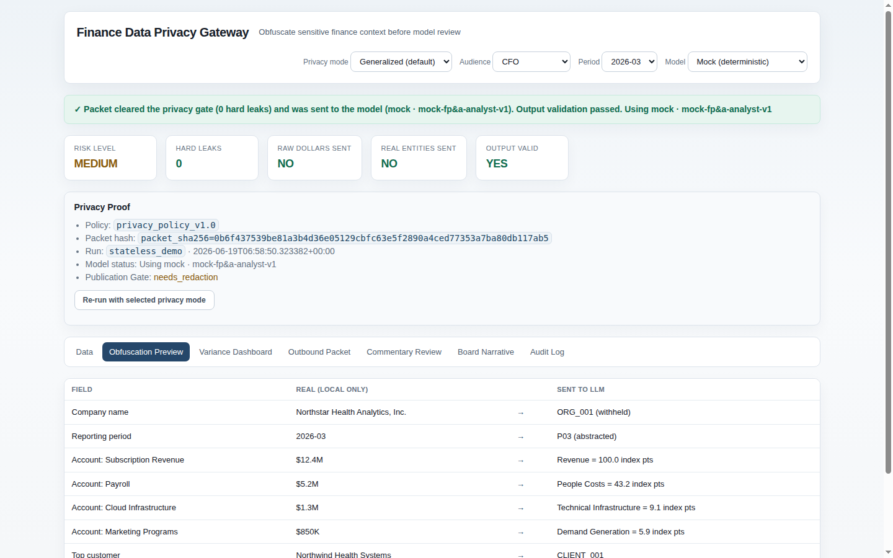
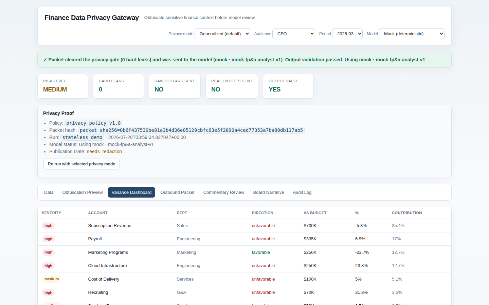
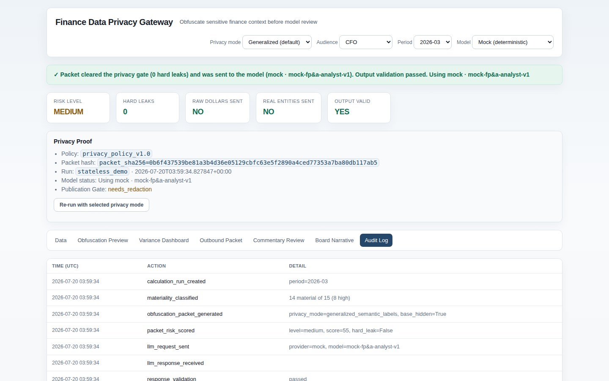

# Finance Privacy Gateway

**AI-native financial analysis — without exposing your financials to the model.**

Finance teams want frontier LLMs to explain variances, pressure-test forecasts, and draft board commentary. CFOs don't want external AI providers seeing real revenue figures, customer names, vendors, payroll, or cash positions.

This gateway sits between your finance data and the model. It performs all financial math locally, transforms your data into a semantically equivalent but obfuscated packet, sends only that packet to the LLM, then rehydrates the model's narrative back into real business terms — for authorized users only.

> **Preserve reasoning value. Destroy identification value.**

The LLM sees `CLIENT_001 represents 31% of revenue` and `Revenue = 100.0 index points, -5.3% vs budget`. It never sees a company name, a real customer, a real vendor, or a single real dollar figure. Every dollar in the final board narrative is inserted locally — never produced by the model.

→ [How it works](#how-it-works) · [Quick start](#quick-start) · [Privacy modes](#privacy-modes-in-depth) · [Architecture](#architecture)



---

## The problem this solves

As AI models become useful for financial analysis, CFOs and finance leaders face a real tension:

**The tools are powerful. The data is sensitive.**

Revenue breakdowns, customer concentration, vendor relationships, headcount and payroll, cash positions, margin by product line — this is material non-public information in many cases. Sending it to an external model creates data governance risk, confidentiality exposure, and in some contexts, legal or regulatory exposure.

The standard workarounds — redacting data, using only aggregates, building internal models — either destroy the analytical value or require significant engineering investment.

This gateway is a third path: send the structure and the relationships, not the sensitive identifiers and amounts. Get back language that makes sense in your business — because the rehydration puts the real terms back in locally.

---

## How it works

```
Upload CSVs → Canonical data model → Local finance engine (Decimal math, deterministic)
  → Materiality engine → Semantic Obfuscation (aliases + value indexing)
  → Packet Risk Gate ──(blocked on hard leak)──→ withhold / local-only
       │ (clean)
       ▼
  Frontier LLM (mock or real) → Response Validator → Rehydration (permission-aware)
  → Human Review (draft, unpublished) → Board Narrative (local dollars inserted)
```

**Three guarantees that are enforced, not promised:**

1. **No raw dollars leave the system.** All financial values are converted to indexed form (Revenue = 100.0 base, all other lines expressed relative to that) before any outbound packet is constructed.

2. **No real entity names leave the system.** Company names, customer names, vendor names, and employee names are replaced with stable aliases (CLIENT_001, VENDOR_A, etc.) before the packet is built.

3. **The packet risk gate is the same code as the privacy regression tests.** There is no drift between what the runtime blocks and what the tests verify. A single leak scanner enforces both.

---

## Feature overview

### Obfuscation Engine
Transforms a canonical finance data package into a semantically equivalent obfuscated packet. Aliases are stable within a session (CLIENT_001 always refers to the same entity). Values are indexed, not removed — so variance relationships and proportions are preserved for LLM reasoning.

### Packet Risk Gate
Every outbound packet passes through a leak scanner before it is sent. Hard leaks — raw dollar amounts, real entity names — block transmission. The packet is either clean or it is not sent. There is no partial pass.

### Multiple Privacy Modes

| Mode | Account labels | Best for |
|---|---|---|
| `standard_finance` | Real account names retained | Maximum analysis quality — internal models |
| `generalized_semantic_labels` *(default)* | Generalized (e.g., Payroll → People Costs) | Normal sensitive workflows |
| `high_privacy` | Abstract (`CAT_017` + descriptor) | Board strategy, M&A, fundraising, layoffs |
| `local_only` | No external call | Maximum sensitivity — no model involved |

### Rehydration (Permission-Aware)
Commentary is stored obfuscated. At view time, it is rehydrated with real business terms — based on the viewer's permission level. A CFO sees the real customer name. A board member sees "Top Customer." The same narrative, appropriately disclosed.

### Human Review & Board Narrative
AI-drafted commentary is queued for human review before any narrative is published. Reviewers approve, edit, or reject individual drafts. The final board narrative is assembled locally — with real dollar figures inserted at publish time, never produced by the model.

### Multi-Period Analysis
Run analysis across multiple periods independently. Each period has an isolated data model, its own materiality results, and its own review queue.

### In-Browser Column Mapping
Upload CSVs from any system. Map columns to the canonical model in-browser. No preprocessing required.

### Real LLM Toggle
The UI includes a provider/model selector and real-LLM toggle. The obfuscation and rehydration path is identical whether the mock engine or a real model is used. Set `OPENAI_API_KEY` and switch to Real in the UI.

### Audit Log
Every event — upload, obfuscation run, packet build, gate result, LLM call, review decision, narrative publish — is logged to SQLite with timestamp, actor, and data reference.

### REST API (Section-15)
A full REST API runs on the same server as the product UI. Endpoints cover dataset management, pipeline execution, review queues, narrative generation, and audit retrieval. See `docs/api_contracts.md` for the full contract and curl walkthrough.

### Docker Support
No pip installs required. The entire product runs on Python 3.10+ standard library. Docker support is included for deployment. `make docker-build && make docker-run`.

---

## Quick start

No dependencies. Pure Python 3.10+ standard library.

```bash
cd privacy_tool
make serve
```

Open `http://127.0.0.1:8770`, go to the **Data** tab, click **Load sample dataset**, and walk the tabs:

1. **Obfuscation Preview** — see exactly what the LLM receives vs. what your data actually says
2. **Variance Dashboard** — material variances computed locally, before any external call
3. **Outbound Packet** — the exact JSON payload that would be sent to the model
4. **Commentary Review** — approve AI-drafted commentary before it enters the narrative
5. **Board Narrative** — the final output, with real dollars inserted locally
6. **Audit Log** — every event in the pipeline





**Run the CLI demo:**
```bash
python3 scripts/run_demo.py
```

Prints the side-by-side obfuscation preview, gate result (0 hard leaks), material variances, rehydrated commentary sample, and writes artifacts to `output/`: `outbound_packet.json`, `llm_response_obfuscated.json`, `review_items.json`, `audit_log.json`, `board_narrative.md`.

**Run tests:**
```bash
python3 -m unittest discover -s tests
```

81 passing tests including the release-blocking privacy regression (`test_privacy_regression.py`) and the FP&A bridge endpoint.

**Use a real LLM** (any OpenAI-compatible endpoint — hosted or local):
```bash
# hosted (e.g. OpenAI)
export OPENAI_API_KEY=sk-...
python3 scripts/run_demo.py --llm openai

# local (e.g. Ollama)
export OPENAI_API_KEY=ollama OPENAI_BASE_URL=http://127.0.0.1:11434/v1 \
       GATEWAY_MODEL=gpt-oss:20b GATEWAY_LLM_TIMEOUT=600
python3 scripts/run_demo.py --llm openai
```

The real-LLM path is verified end-to-end against a live model. The client requests
decoder-enforced structured outputs (`response_format: json_schema`, with plain-JSON fallback for
servers that don't support it); responses are normalized for mechanical shape drift, validated
(schema, known issue IDs, no invented synthetic entities, no currency amounts), and retried once
with the validation errors if a real model deviates. If a response still fails validation, the
gateway **fails closed**: nothing is rehydrated and the errors are reported. The
obfuscation/rehydration path is identical regardless of engine.

Env: `OPENAI_API_KEY` · `OPENAI_BASE_URL` (default `https://api.openai.com/v1`) ·
`GATEWAY_MODEL` (default `gpt-4o-mini`) · `GATEWAY_LLM_TIMEOUT` seconds (default `60`; raise for
local models).

**Docker:**
```bash
make docker-build && make docker-run
```

---

## Architecture

```
gateway/
  finance_core/     normalization · calculations · materiality       (local math, never sent)
  obfuscation/      aliases · indexing · leak_scanner · risk_scoring  (the privacy core)
                    packet_builder · rehydration
  llm_client/       schemas · prompts · mock_llm · validator · client
  pipeline.py       end-to-end orchestrator + audit trail
  db.py             SQLite persistence (Postgres-ready model)
scripts/
  generate_sample_data.py   synthetic finance package
  run_demo.py               one-command CLI proof
  serve.py                  unified product server (UI + API + DB)
sample_data/                synthetic finance package (fake company, planted scenarios)
tests/                      81 tests including test_privacy_regression.py (release-blocking)
docs/
  api_contracts.md          REST API endpoints + curl walkthrough
```

**Key design decisions:**

- **Enforcement and testing share the same code.** The `leak_scanner` is both the runtime send-gate and the test oracle. If the test passes, the gate blocks the same things in production. They cannot drift apart.
- **No dependencies.** The product runs on Python standard library. No pip, no venv, no setup friction.
- **Local math is Decimal.** Financial calculations use Python's `Decimal` module for precision. No floating-point rounding artifacts in materiality decisions.
- **SQLite with a Postgres-ready model.** Persistence is SQLite for zero-setup local use; the schema and ORM layer are designed to switch to Postgres without data or logic changes.

---

## Integration with FP&A Variance Copilot

This gateway integrates directly with the [FP&A Variance & Re-Forecast Copilot](https://github.com/eddiepastore/fpa-variance-copilot).

When Privacy Mode is enabled in the FP&A app:
1. The app builds an obfuscated packet from the canonical finance data model.
2. The packet is sent to this gateway's REST API for LLM analysis.
3. The gateway validates, calls the model, validates the response, and returns rehydrated commentary.
4. The FP&A app presents the commentary to the human reviewer — with real terms, sourced locally.

Neither app exposes real financial data to the model. Both maintain full audit trails. The review gate and publish gate in the FP&A app remain active — the privacy layer adds protection without removing human control.

---

## Privacy modes in depth

### `standard_finance`
Real account names are retained. Entity aliases and value indexing still apply. Use when running against an internal model or when account-label exposure is acceptable.

### `generalized_semantic_labels` (default)
Account names are generalized to semantic categories: `Payroll` becomes `People Costs`, `AWS` becomes `Infrastructure`. Entity aliases and value indexing apply. Good for normal CFO/finance-team workflows where account-level detail is sensitive but category-level exposure is acceptable.

### `high_privacy`
Account names become abstract identifiers with descriptors: `CAT_017 (Operating Expense)`. Entity aliases and value indexing apply. Use for board-level strategy, M&A diligence, fundraising analysis, or layoff/restructuring planning — any scenario where the full account structure is sensitive.

### `local_only`
No external call is made. The finance engine runs locally and produces output without any LLM involvement. Use when data sensitivity precludes external calls entirely, or for testing and audit.

---

## Background

The impetus for this project was direct: using frontier LLMs to pressure-test financial models and draft board commentary is genuinely useful — the models can identify structural variance patterns, flag forecast method inconsistencies, and draft clear explanatory language faster than most analysts. But sending real financial data to an external provider raises legitimate governance and confidentiality concerns, especially for pre-public companies, regulated entities, or businesses with concentrated customer relationships.

The solution is a privacy architecture, not a restriction. You get the reasoning value of a frontier model. The model never sees the data that matters. The audit trail proves it.

---

## Status

**Sprints 1–7 complete.** All core features are implemented and tested:

- Local finance engine with Decimal math and materiality rules
- Semantic obfuscation (aliases + value indexing) with privacy regression test
- Packet risk gate (hard leak detection, transmission block)
- Mock and real-LLM support (OpenAI-compatible endpoints)
- Response validation and permission-aware rehydration
- Human review queue and board narrative generation
- Multi-period analysis with isolated per-period data models
- In-browser column mapping
- Section-15 REST API with SQLite persistence
- Dockerfile + Makefile packaging
- 81 passing tests

See `changelog.md` for the full sprint log.

---

*Demo data is synthetic. This is a decision-support tool and does not constitute financial advice.*
